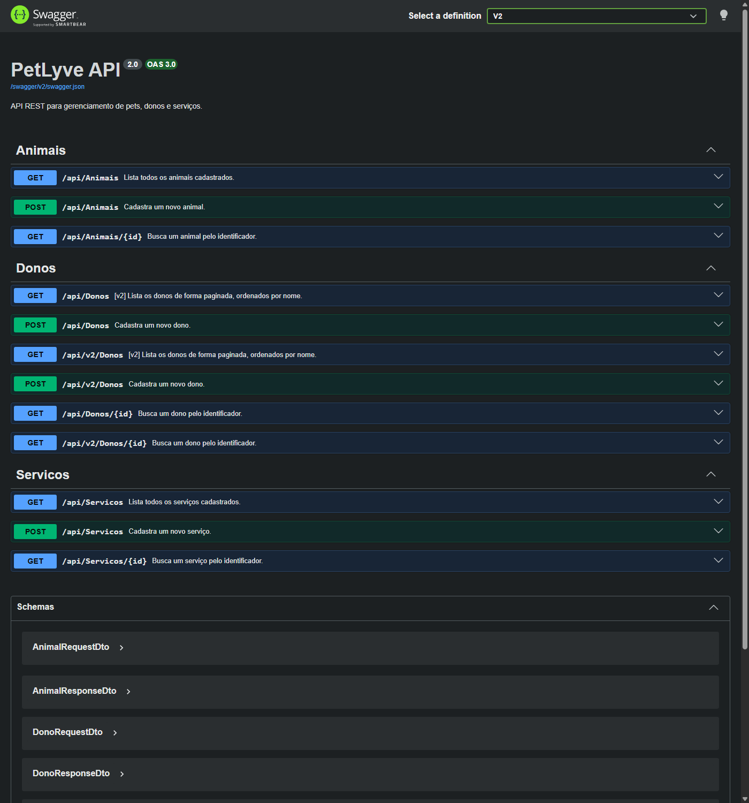
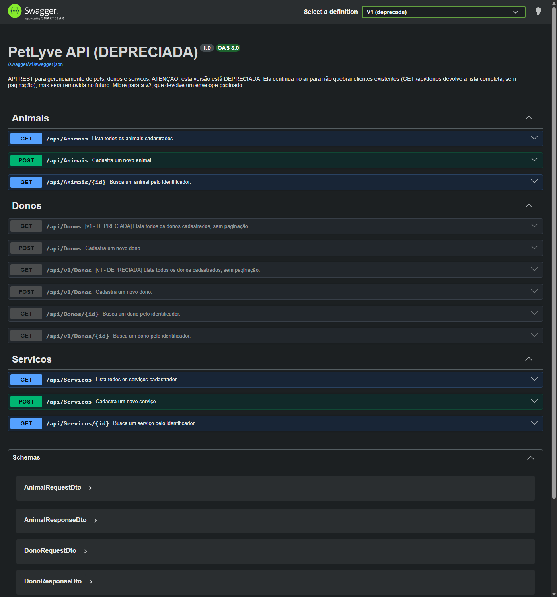

# CP5 — Swagger com um documento por versão

Ambiente Development: `http://localhost:5091/swagger`. O seletor **Select a definition** alterna entre **V2** (padrão) e **V1 (deprecada)**.

| V2 (atual) | V1 (deprecada) |
|---|---|
|  |  |

## Trecho de `/swagger/v1/swagger.json`

```json
{
  "openapi": "3.0.4",
  "info": {
    "title": "PetLyve API (DEPRECIADA)",
    "description": "API REST para gerenciamento de pets, donos e serviços. ATENÇÃO: esta versão está DEPRECIADA. Ela continua no ar para não quebrar clientes existentes (GET /api/donos devolve a lista completa, sem paginação), mas será removida no futuro. Migre para a v2, que devolve um envelope paginado.",
    "version": "1.0"
  }
}
```

Operações de Donos neste documento:

| Método | Rota | Resumo | deprecated |
|---|---|---|---|
| GET | `/api/Donos` | [v1 - DEPRECIADA] Lista todos os donos cadastrados, sem paginação. | **true** |
| POST | `/api/Donos` | Cadastra um novo dono. | **true** |
| GET | `/api/v1/Donos` | [v1 - DEPRECIADA] Lista todos os donos cadastrados, sem paginação. | **true** |
| POST | `/api/v1/Donos` | Cadastra um novo dono. | **true** |
| GET | `/api/Donos/{id}` | Busca um dono pelo identificador. | **true** |
| GET | `/api/v1/Donos/{id}` | Busca um dono pelo identificador. | **true** |

Recursos não versionados (`[ApiVersionNeutral]`) presentes no documento: `/api/Animais`, `/api/Animais/{id}`, `/api/Servicos`, `/api/Servicos/{id}`

## Trecho de `/swagger/v2/swagger.json`

```json
{
  "openapi": "3.0.4",
  "info": {
    "title": "PetLyve API",
    "description": "API REST para gerenciamento de pets, donos e serviços.",
    "version": "2.0"
  }
}
```

Operações de Donos neste documento:

| Método | Rota | Resumo | deprecated |
|---|---|---|---|
| GET | `/api/Donos` | [v2] Lista os donos de forma paginada, ordenados por nome. | false |
| POST | `/api/Donos` | Cadastra um novo dono. | false |
| GET | `/api/v2/Donos` | [v2] Lista os donos de forma paginada, ordenados por nome. | false |
| POST | `/api/v2/Donos` | Cadastra um novo dono. | false |
| GET | `/api/Donos/{id}` | Busca um dono pelo identificador. | false |
| GET | `/api/v2/Donos/{id}` | Busca um dono pelo identificador. | false |

Recursos não versionados (`[ApiVersionNeutral]`) presentes no documento: `/api/Animais`, `/api/Animais/{id}`, `/api/Servicos`, `/api/Servicos/{id}`

